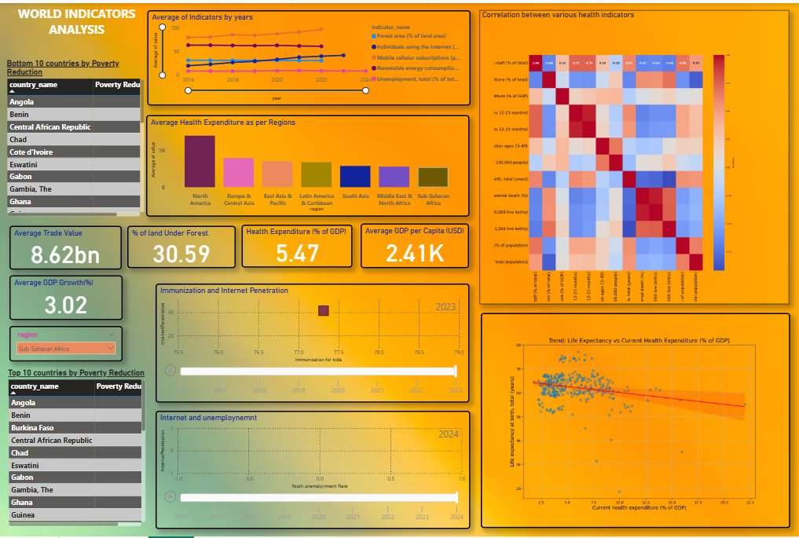

# World Development Analytics: Multi-Domain Global Indicators Dashboard

The primary goal of this project is to extract, process, and analyze development data across 217 countries and 7 thematic domains — economic activity, labour markets, trade, poverty, environment, health, and technology — using the World Bank Open API. By consolidating 26 indicators spanning 2016 to 2024 into structured, analysis-ready datasets, the project enables cross-country and cross-regional comparisons through an interactive Power BI dashboard that surfaces patterns in development, inequality, health outcomes, and digital access at a global scale.

---

## Data Source

All data was programmatically fetched from the **World Bank Open Data API** (`https://api.worldbank.org/v2/`) using Python's `requests` library. No manual data downloads were involved — the notebook automates the full pipeline from API call to cleaned CSV export.

The API returns two components per response: a metadata block (page count, total records) and the actual data payload. Pagination was handled dynamically using the `pages` field from the metadata to loop through all available pages per indicator.

**Coverage:**
- **217 countries** (including aggregate regional groupings)
- **7 world regions**: North America, Europe & Central Asia, East Asia & Pacific, Latin America & Caribbean, South Asia, Middle East & North Africa, Sub-Saharan Africa
- **4 income levels**: Low income, Lower middle income, Upper middle income, High income
- **Years**: 2016 – 2024
- **Total records fetched**: ~62,000 across all category files

---

## Indicator Groups & World Bank Codes

Data was organized into 7 thematic categories, each fetched and saved as a separate CSV.

**Economic Activity** (`economic.csv`)
- `NY.GDP.MKTP.KD.ZG` — GDP growth (annual %)
- `NY.GDP.PCAP.CD` — GDP per capita (current US$)

**Labour Market** (`labour_market.csv`)
- `SL.UEM.TOTL.ZS` — Unemployment, total (% of total labor force)
- `SL.UEM.1524.ZS` — Unemployment, youth total (% ages 15–24)
- `SL.TLF.TOTL.IN` — Labor force, total

**Trade & Globalization** (`trade.csv`)
- `NE.EXP.GNFS.CD` — Exports of goods and services (current US$)
- `NE.IMP.GNFS.CD` — Imports of goods and services (current US$)

**Poverty & Inequality** (`poverty.csv`)
- `SI.POV.NAHC` — Poverty headcount ratio at national poverty lines (% of population)
- `SI.POV.GINI` — Gini index

**Environment** (`environment.csv`)
- `EG.FEC.RNEW.ZS` — Renewable energy consumption (% of total final energy consumption)
- `AG.LND.FRST.ZS` — Forest area (% of land area)

**Health** (`health.csv`) — 13 indicators including:
- `SP.DYN.LE00.IN` — Life expectancy at birth, total (years)
- `SP.DYN.IMRT.IN` — Mortality rate, infant (per 1,000 live births)
- `SH.XPD.CHEX.GD.ZS` — Current health expenditure (% of GDP)
- `SH.IMM.IDPT` — Immunization, DPT (% of children ages 12–23 months)
- `SH.IMM.MEAS` — Immunization, measles (% of children ages 12–23 months)
- `SH.MMR.RISK` — Lifetime risk of maternal death (%)
- `SH.TBS.INCD` — Incidence of tuberculosis (per 100,000 people)
- `SH.HIV.INCD.ZS` — Incidence of HIV, ages 15–49
- `SH.STA.BRTC.ZS` — Births attended by skilled health staff (% of total)
- and 4 additional mortality and population indicators

**Technology** (`technology.csv`)
- `IT.NET.USER.ZS` — Individuals using the Internet (% of population)
- `IT.CEL.SETS.P2` — Mobile cellular subscriptions (per 100 people)

---

## Approach

### 1. Country Metadata Extraction

The first step fetched all country metadata from `https://api.worldbank.org/countries?format=json&per_page=300`. The response contained nested JSON fields for `region`, `incomeLevel`, and `lendingType`, which were flattened by extracting the `value` key from each nested dict using `.apply(lambda x: x["value"])`. Redundant columns (`adminregion`, `capitalCity`) were dropped, and `iso2Code` was renamed to `country_id` for join compatibility.

### 2. Indicator Catalogue Fetch

All ~26,000 World Bank indicators were fetched across 525 paginated API pages and saved to `final_df.csv`. This served as the indicator reference catalogue — a lookup of indicator IDs and human-readable names used to select the 26 domain-specific indicators for analysis.

### 3. Domain Data Extraction

For each of the 7 thematic categories, the notebook looped over the assigned indicator codes and fetched data for all countries simultaneously using the `countries/all/indicators/{code}` endpoint. Pagination was handled dynamically: the `pages` value from the metadata block controlled the `while True` loop, which broke when all pages were exhausted. Each page's records were normalized via `pd.json_normalize()` and appended before concatenation.

### 4. Country Enrichment via Merge

Each category's raw indicator data was merged with the country metadata table on `country_id` using an inner join, adding `region`, `incomeLevel`, `lendingType`, `longitude`, and `latitude` to every record. Redundant columns (`indicator_id`, `name`, `id`) were dropped post-merge, producing 7 clean, analysis-ready DataFrames.

### 5. Health Correlation Analysis (Pivot + Heatmap)

The health dataset — the largest at 31,122 records across 13 indicators — was pivoted from long to wide format using `pivot_table(index=["country_value", "year"], columns="indicator_name", values="value")`, enabling pairwise correlation analysis across all 13 health indicators. This correlation matrix is visualized in the dashboard as a heatmap revealing structural relationships between expenditure, immunization rates, mortality, and life expectancy.

### 6. Power BI Dashboard

All 7 cleaned CSVs were loaded into Power BI and connected through shared dimensions (`country_value`, `year`, `region`). The dashboard surfaces trends, rankings, correlations, and scatter relationships across all domains in a single filterable view, with slicers for region and year.



The dashboard includes:
- **Bottom / Top 10 countries by Poverty Reduction** — ranked tables with regional slicer (default: Sub-Saharan Africa)
- **Average of Indicators by Year** — multi-line trend chart for Forest area, Internet penetration, Mobile subscriptions, Renewable energy consumption, and Unemployment (2016–2024)
- **Average Health Expenditure by Region** — bar chart comparing health spend as % of GDP across all 7 regions; North America leads significantly
- **Correlation Heatmap** — pairwise correlations across all 13 health indicators
- **Immunization and Internet Penetration** — animated scatter with year slider
- **Internet and Unemployment** — animated scatter tracking youth unemployment against internet penetration over time
- **Life Expectancy vs. Health Expenditure** — scatter with regression trend line revealing a counterintuitive negative slope at the country level, driven by high-spending, poor-outcome outliers
- **KPI Cards**: Average Trade Value (8.62bn), % of Land Under Forest (30.59), Health Expenditure % of GDP (5.47), Average GDP per Capita (2.41K), Average GDP Growth % (3.02)

---

## Key Findings

- **Sub-Saharan Africa dominates the poverty bottom rankings** — countries like Angola, Benin, Chad, and Central African Republic consistently appear in the bottom 10, reflecting persistent structural development gaps relative to all other regions.
- **Health expenditure does not straightforwardly predict life expectancy** — the scatter with regression line shows a slight negative slope at the country level, driven by high-income countries with high spending and disease burden vs. low-income countries with younger populations and lower spend.
- **Internet penetration and immunization move together** — the animated scatter suggests countries with higher digital access also tend to have stronger health infrastructure, pointing to a shared underlying development factor rather than a direct causal link.
- **Renewable energy and forest cover have trended modestly upward globally** — the multi-indicator trend chart shows slow but consistent improvement in both environmental indicators from 2016 to 2024.
- **North America's health expenditure dwarfs all other regions** — the regional health bar chart shows a large gap between North America and the rest, while Sub-Saharan Africa sits at the bottom of the distribution.
- **Youth unemployment remains structurally elevated even with growing internet access** — the Internet vs. Unemployment scatter shows that digital connectivity alone is insufficient to resolve labour market absorption challenges.

---

## Tech Stack

| Tool | Purpose |
|---|---|
| Python (`requests`, `pandas`) | API extraction, pagination, JSON normalization, merging |
| World Bank Open Data API | Source for all 26 indicators across 217 countries |
| Jupyter Notebook | End-to-end data pipeline |
| CSV | Intermediate storage for 7 domain datasets + indicator catalogue |
| Power BI | Multi-domain interactive dashboard |

---

## Repository Structure

```
├── API_Data.ipynb            # Full data extraction and processing pipeline
├── final_df.csv              # World Bank indicator catalogue (~26,000 indicators)
├── economic.csv              # GDP growth & GDP per capita (4,788 records)
├── environment.csv           # Renewable energy & forest area (4,788 records)
├── health.csv                # 13 health indicators (31,122 records)
├── labour_market.csv         # Unemployment & labour force (7,182 records)
├── poverty.csv               # Poverty headcount & Gini index (4,788 records)
├── technology.csv            # Internet & mobile subscriptions (4,788 records)
└── trade.csv                 # Exports & imports (4,788 records)
```

---

## Conclusion

- This project demonstrates a fully automated data pipeline that pulls live development data directly from the World Bank API, structures it across 7 thematic domains, and consolidates it into a unified analytical dashboard. The absence of any manual data collection — with pagination, JSON flattening, and country enrichment all handled programmatically — makes the pipeline reproducible and extensible to any of the ~26,000 available World Bank indicators.

- The health domain analysis is the most analytically rich component: 13 indicators across 217 countries enabled a full correlation matrix, revealing which health outcomes cluster together and which expenditure patterns are genuinely predictive of population welfare. The pivot-based reshaping from long to wide format was a necessary preprocessing step that unlocked this correlation layer.

- Taken together, the dashboard makes a case that development outcomes are multidimensional and region-specific. Internet penetration, immunization rates, trade volumes, and poverty ratios do not move in isolation — they reflect underlying structural conditions that vary sharply by region and income level, and which require a multi-indicator view to interpret meaningfully.
